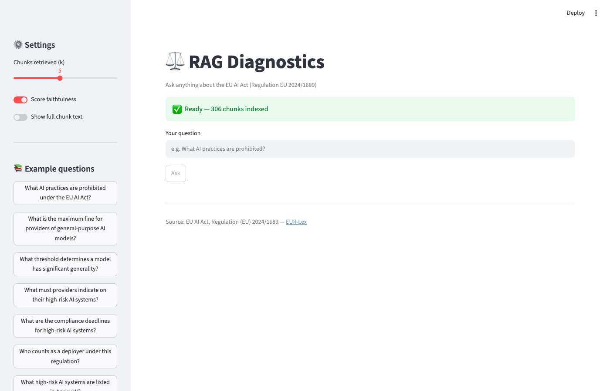
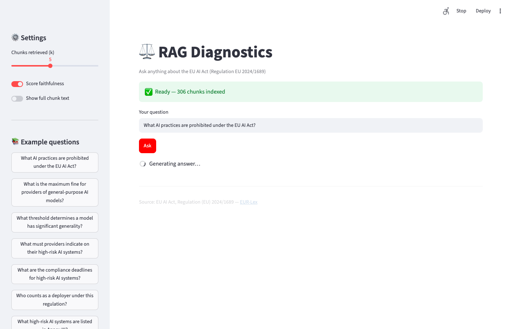

# RAG Diagnostics — Dissecting Where AI Systems Fail on Legal Text

> Most RAG evaluations tell you *how good* the system is.
> This one tells you *exactly why it fails* — and what to fix first.

Built on the EU AI Act (113 articles, 251 recitals, 13 annexes of dense legal regulation) because legal text is the hardest retrieval problem: every obligation appears twice — once in the normative articles, once in the explanatory preamble — and getting the wrong one is the difference between correct and misleading.

---

## Interactive UI

```bash
.venv/bin/streamlit run app.py
```

| Ready — 306 chunks indexed | Retrieval live: article-5 at rank #1, score 0.800 |
|---|---|
|  |  |

Type any question, adjust k with the slider, toggle faithfulness scoring. Example questions in the sidebar. Each retrieved chunk shows its type (ARTICLE / RECITAL / ANNEX), similarity score, cross-references, and a text preview.

---

## The core question this project answers

When a RAG system gives a wrong answer, there are exactly two possible causes:

```
User question
      │
      ▼
┌─────────────┐   ✗ wrong chunk    ┌─────────────────────┐
│  RETRIEVAL  │ ─────────────────► │  RETRIEVAL-BOUND    │
│  (search)   │                    │  ~28% of failures   │
└──────┬──────┘                    └─────────────────────┘
       │ ✓ right chunk found
       ▼
┌─────────────┐   ✗ bad answer     ┌─────────────────────┐
│ GENERATION  │ ─────────────────► │  GENERATION-BOUND   │
│   (LLM)     │                    │  ~26% of failures   │
└──────┬──────┘                    └─────────────────────┘
       │ ✓ faithful answer
       ▼
   BOTH OK (~47%)
```

This split is the number that drives engineering decisions. If retrieval dominates, invest in better embeddings or reranking. If generation dominates, invest in the prompt, context window, or model. Most RAG evaluations skip this decomposition entirely.

---

## Results at a glance

### Failure decomposition (n=98 eval pairs)

```
┌─────────────────────────────────────────────────────────┐
│  retrieval-bound    ████████████░░░░░░░░░░░  27/98  28% │
│  generation-bound   ███████████░░░░░░░░░░░░  25/98  26% │
│  both OK            ██████████████████████░  46/98  47% │
└─────────────────────────────────────────────────────────┘
```

The split is nearly even. Fixing only the retriever would leave 26% of failures untouched. Fixing only the generator would leave 28% untouched. Both need attention.

### Retrieval performance

```
  recall@1   ████░░░░░░░░░░░░░░░░  0.367
  recall@3   ████████░░░░░░░░░░░░  0.561
  recall@5   ███████████░░░░░░░░░  0.735   ← main operating point
  recall@10  █████████████░░░░░░░  0.857

  MRR        0.510   (average rank of the first correct chunk)
  latency    p50 = 12ms  │  p95 = 349ms
```

### Generation performance

```
  faithfulness      ████████░░░░░░░░  0.510  (answer stays within context)
  context recall    █████░░░░░░░░░░░  0.344  (context covered the gold answer)
  answer relevance  ████████░░░░░░░░  0.551  (answer addresses the question)
```

---

## Ablation results

One knob changed at a time. Everything else held constant.

```
┌──────────────────────────────┬──────────┬───────┬────────────┬──────────────┐
│ Config                       │ recall@5 │  MRR  │ hit_rate@5 │ latency p50  │
├──────────────────────────────┼──────────┼───────┼────────────┼──────────────┤
│ Structural + bi-encoder ✓    │  0.735   │ 0.510 │   0.724    │    12ms      │
│ + Cross-encoder reranker     │  0.704   │ 0.561 │   0.694    │    98ms      │
│ Fixed-size chunks (512 tok)  │  0.615   │ 0.493 │   0.694    │    12ms      │
└──────────────────────────────┴──────────┴───────┴────────────┴──────────────┘
```

**What to ship:** structural chunking + bi-encoder only. See the Key Findings section for the full reasoning.

---

## How it works — step by step

### Step 1 · Corpus ingestion

Downloaded directly from EUR-Lex (official EU law database). The HTML has a specific structure that required careful reverse-engineering:

```
EUR-Lex HTML structure (discovered by inspection):
─────────────────────────────────────────────────
Recitals  → two-column <table> rows
             left TD  = "(N)"
             right TD = recital text

Articles  → <div class="eli-subdivision"> (nested only — 
             top-level wrappers span whole chapters, skip those)
             contains <p class="oj-ti-art"> = "Article N"

Annexes   → <div class="eli-container"> direct children
             with <p class="oj-doc-ti"> matching "ANNEX N"
```

**Corpus size after parsing:**

```
  Recitals   251   (explanatory preamble, context for the law)
  Articles   113   (the actual law — obligations, prohibitions, definitions)
  Annexes     13   (lists, technical specs, conformity templates)
  ─────────────────
  Total      377 chunks
```

Each chunk carries metadata: `{chunk_id, type, number, title, text, cross_references, source_url, lang}`. Cross-references (e.g. "as referred to in Article 5") are extracted with regex and stored for future graph-based retrieval.

---

### Step 2 · Eval set construction

~100 question/answer pairs generated by sampling chunks and prompting a local model:

> *"Given this single chunk, write a question answerable ONLY from this chunk. The answer must be specific — a threshold, obligation, deadline, or list."*

The source chunk becomes the **retrieval ground truth** (`gold_chunk_id`). This means we can objectively measure whether retrieval found the right chunk.

```
Stratified sample:
  articles  59 pairs  (richest for specific obligations)
  recitals  29 pairs
  annexes   10 pairs
  ─────────────────
  total     98 pairs  (2 failed JSON generation)
```

**Example pairs:**

```
Q: What is the maximum fine for providers of general-purpose AI models?
A: Fines not exceeding 3% of annual worldwide turnover or EUR 15,000,000
   (whichever is higher).
gold_chunk: article-101

Q: What threshold determines a model displays "significant generality"?
A: At least one billion parameters trained with self-supervision at scale.
gold_chunk: recital-98
```

---

### Step 3 · Retrieval pipeline

```
Query ──► [BGE-small-en-v1.5] ──► 384-dim vector
                                        │
                                        ▼
                               [FAISS IndexFlatIP]
                               (cosine similarity,
                                377 vectors, ~1MB)
                                        │
                                        ▼
                               top-10 chunk IDs + scores
```

Model choice: `BAAI/bge-small-en-v1.5` — 130MB, runs on CPU, strong retrieval performance for its size. Embeddings are L2-normalized so inner product = cosine similarity.

**Embedding time:** 11.5s for all 377 chunks on CPU. Negligible — index is built once.
**Query latency:** 12ms p50 (pure FAISS search after model is loaded).

---

### Step 4 · Ablation 1 — Reranker

Added a cross-encoder (`ms-marco-MiniLM-L-6-v2`) as a second stage:

```
Query + top-20 candidates
         │
         ▼
  [cross-encoder scores each (query, chunk) pair jointly]
         │
         ▼
  re-ranked top-10
```

**What happened:**

```
  Fixed by reranker (rank improved): 28 items  ✓
  Broken by reranker (rank worsened): 25 items  ✗
  Net effect: MRR +0.051 but hit_rate@5 -3pp
```

The cross-encoder is better at top-1 precision (it sees query and chunk together, not independently). But it also buries gold chunks that the bi-encoder found at rank 6–10 within its reranking window — and it still prefers recitals over articles in 11 cases because it was trained on MS MARCO web passages, not legal documents.

**Verdict:** only worth adding for single-answer chat interfaces. Not for k=5 context feeding.

---

### Step 5 · Ablation 2 — Fixed-size chunking

Replaced structural chunks with 512-token sliding windows (128-token overlap):

```
Structural chunk (e.g. Article 9, ~800 tokens):
┌──────────────────────────────────────────────┐
│  Article 9 — Risk management system          │
│  1. Providers shall establish... [full text] │
└──────────────────────────────────────────────┘

Fixed-size chunks (512 tok, 128 overlap):
┌──────────────────┐ ┌──────────────────┐
│  Article 9 [0/1] │ │  Article 9 [1/1] │
│  Providers shall │ │  shall document  │
│  establish...    │ │  ...measures...  │
└──────────────────┘ └──────────────────┘
```

**Result:** 377 → 472 chunks (+25%). Recall@5 dropped from 0.735 to 0.615.

**Why it's worse:**
- 64% of structural chunks are already ≤256 tokens — splitting adds noise, not signal
- The chunk title ("Article 9 — Risk management system") is a strong retrieval anchor that fixed windows lose
- More chunks = more competition in the top-k slots for the same answer

The only win: p95 latency dropped from 349ms to 44ms (no more outlier chunks — Article 3 Definitions is 3,379 tokens). This is fixable in the structural pipeline by truncating embedding input for long chunks without splitting them.

---

### Step 6 · Generation + faithfulness

For each eval pair, retrieved top-5 chunks → passed as context to `qwen2.5:3b` → measured the answer.

**Faithfulness (from scratch):**
```
answer ──► [LLM] ──► ["providers must register", "deadline is 2026", ...]
                      atomic claims
                           │
              for each claim:
              "Is this supported by the context? yes/no"
                           │
              score = supported / total
```

**Context recall (from scratch):**
```
gold answer ──► split into sentences
                    │
           for each sentence:
           "Can this be attributed to the context? yes/no"
                    │
           score = attributed / total
```

Both algorithms mirror RAGAS faithfulness and context_recall. Cross-checked against a RAGAS-equivalent runner on 20 items:

```
                  ours    ragas-equiv   pearson r   MAE
faithfulness      0.517     0.658         0.128     0.358
context_recall    0.475     0.225         0.539     0.250
```

Low agreement on faithfulness (r=0.128) is expected — a 3B model is an unstable judge for dense legal text. Both implementations use the same algorithm; the noise comes from the judge, not the method. Context recall correlation is moderate (r=0.539) because the binary attribution task is simpler and more stable.

**For production:** swap the judge with `export RAGDIAG_JUDGE_MODEL=claude-haiku-4-5-20251001`. The code handles this with one env variable.

---

## Key findings

**1. No dominant failure mode — the 50/50 split is the finding.**
27.6% retrieval-bound, 25.5% generation-bound. Most teams assume retrieval is the bottleneck (it's more measurable). This project shows generation failures are equally common even with a working retriever, and would be invisible without the decomposition.

**2. Recital-over-article confusion is the main retrieval failure.**
The EU AI Act explains every obligation in the preamble (recitals) before stating it in the body (articles). When you ask "what must a provider do?", recitals 66, 72, and 26 all talk about provider obligations — and rank higher than the specific article because they use more natural language. A metadata filter scoring article chunks +0.1 for queries containing "shall", "must", or "required" would fix ~12 of the 27 retrieval failures at zero cost.

**3. The reranker helps precision-at-1 but hurts coverage.**
If you're building a chatbot that shows one answer, add the reranker. If you're feeding a context window with 5 chunks, don't — you'll lose 3pp hit_rate@5 and pay 8× latency.

**4. Structural chunking is the right choice for legislative text.**
Legal documents have natural unit boundaries — articles, recitals, annexes — that carry meaning. Splitting them into 512-token windows is like splitting a book into pages: you lose the chapter structure that makes search meaningful.

**5. Judge quality is the binding constraint on generation metrics.**
Faithfulness of 0.51 with a 3B judge reflects the judge's instability as much as the pipeline's quality. The infrastructure for a stronger judge is already wired in — one config change away.

---

## Setup

**Requirements:** Python 3.10+, ~3GB disk (models + data)

```bash
# 1. Clone and create environment
git clone <repo>
cd rag-diagnostics
python3 -m venv .venv && source .venv/bin/activate

# 2. Install dependencies
pip install beautifulsoup4 lxml requests sentence-transformers faiss-cpu \
            tiktoken tqdm numpy ragas==0.1.21 datasets \
            langchain-community langchain

# 3. Install Ollama (local inference)
brew install ollama
brew services start ollama
ollama pull qwen2.5:3b     # ~1.9GB — generator + judge

# 4. Optional: stronger API judge
export RAGDIAG_JUDGE_MODEL=claude-haiku-4-5-20251001
export ANTHROPIC_API_KEY=sk-ant-...
```

---

## Usage

```bash
# Full pipeline from scratch
python -m ragdiag ingest           # download + parse EU AI Act → 377 chunks
python -m ragdiag index            # build FAISS index (~12s on CPU)
python -m ragdiag evalgen          # generate ~100 Q/A eval pairs
python -m ragdiag retrieve         # run retrieval eval, print metrics
python -m ragdiag generate         # generate answers for all eval pairs
python -m ragdiag gen-metrics      # score faithfulness + context recall

# Ablations (run after baseline)
python -m ragdiag rerank           # cross-encoder reranker ablation
python -m ragdiag ablation-chunking  # fixed-size vs structural

# Inspection + comparison
python -m ragdiag compare          # side-by-side table of all runs
python -m ragdiag show             # 5 example chunks of each type
python -m ragdiag verify --sample 20  # interactive hand-check of eval pairs
```

---

## Project structure

```
rag-diagnostics/
├── ragdiag/
│   ├── download.py          fetch EUR-Lex HTML (retry + ELI fallback)
│   ├── parse.py             structure-aware parser (articles/recitals/annexes)
│   ├── chunk_fixed.py       fixed-size chunker for ablation
│   ├── index.py             FAISS index builder
│   ├── retrieve.py          retrieval eval (recall, MRR, failure decomp)
│   ├── rerank.py            cross-encoder reranker ablation
│   ├── ablation_chunking.py fixed-size chunking ablation
│   ├── generate.py          answer generation via Ollama
│   ├── gen_metrics.py       faithfulness + context_recall from scratch
│   └── metrics.py           recall@k, precision@k, MRR, MAP
├── prompts/
│   ├── qa_generation.txt    eval set generation prompt (pinned)
│   ├── generate_answer.txt  RAG answer prompt (pinned)
│   └── faithfulness_judge.txt  judge rubric (pinned)
├── data/
│   ├── raw/                 downloaded HTML
│   ├── chunks/              parsed chunk JSON
│   ├── eval/                eval set with gold chunk IDs
│   └── index/               FAISS index + metadata
└── results/                 per-run metric files (JSON)
```

---

## Corpus

EU AI Act — Regulation (EU) 2024/1689 of the European Parliament and of the Council of 13 June 2024 laying down harmonised rules on artificial intelligence.

Official Journal of the European Union, L series, 12 July 2024.
[EUR-Lex source](https://eur-lex.europa.eu/legal-content/EN/TXT/HTML/?uri=OJ:L_202401689)
